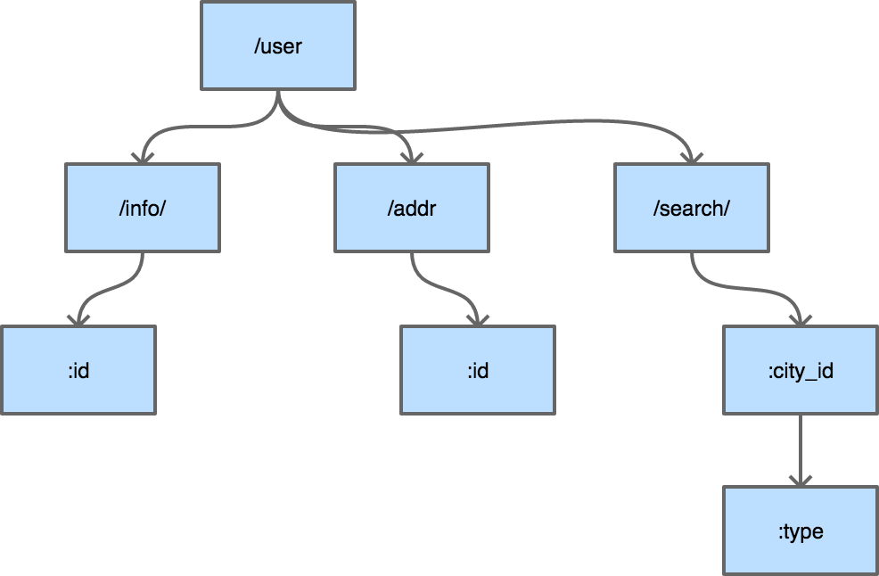
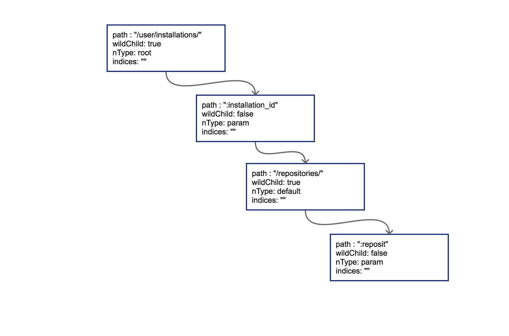
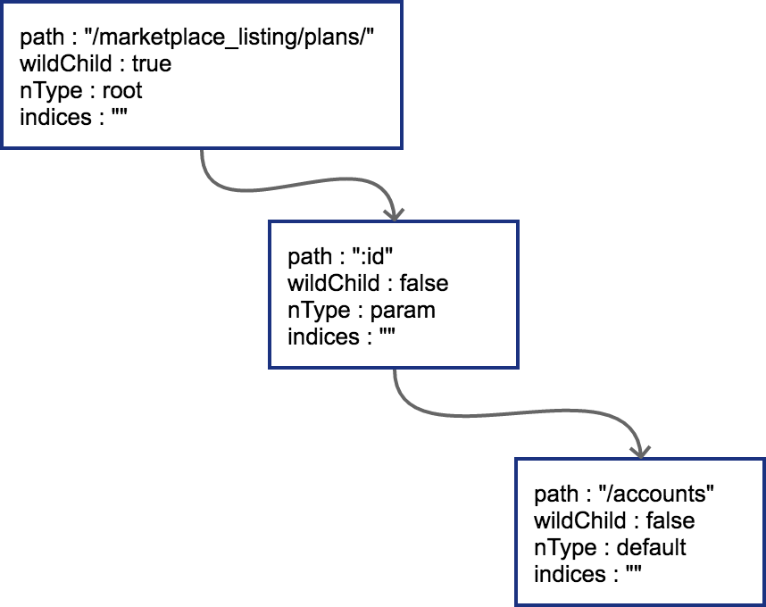
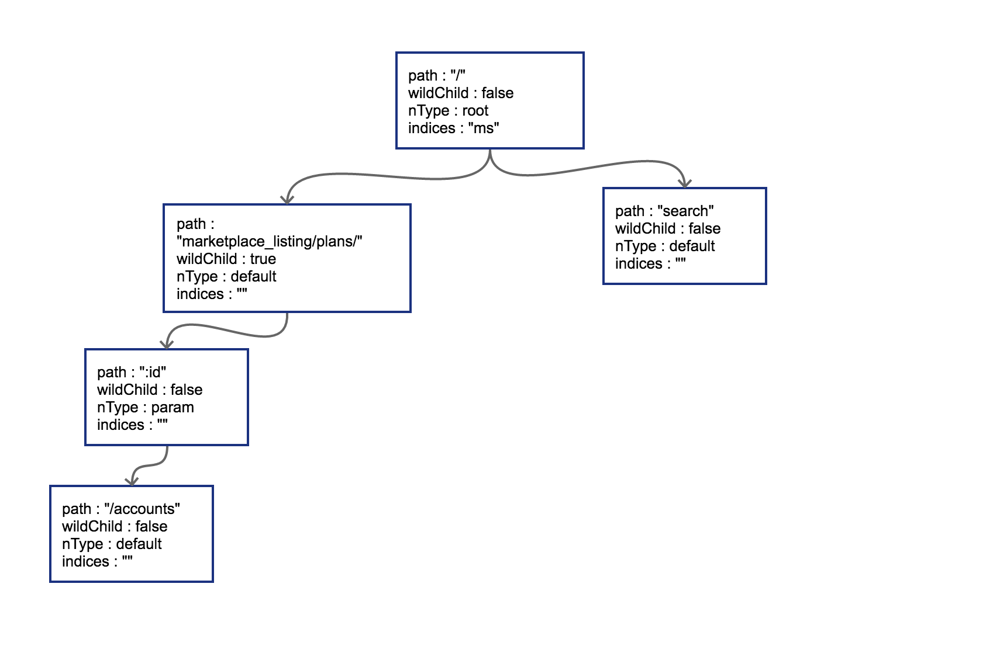
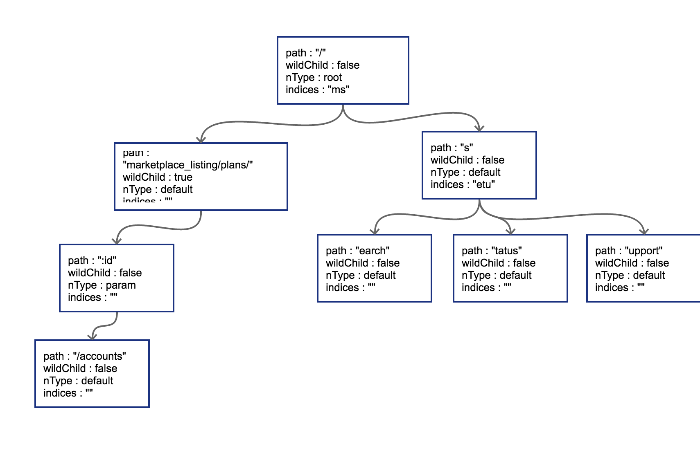

# 5.2 Routing

Ở những framework web thông thường, router sẽ có nhiều thành phần. Router trong ngôn ngữ Go cũng thường gọi  `multiplexer` của gói `http`. Trong phần trước, chúng ta đã học được làm cách nào dùng `http mux` là một thư viện chuẩn để hiện thực hàm routing đơn giản. Nếu việc phát triển hệ thống Web không quan tâm đến thiết kế các URI chứa parameters thì chúng ta có thể dùng thư viện chuẩn `http`  `mux`.

RESTful là một làn sóng thiết kế API bắt đầu những năm gần đây. Ngoài những phương thức GET, POST, RESTful cũng quy định vài method khác được định nghĩa bởi giao thức HTTP bao gồm:

```
const (
    MethodGet     = "GET"
    MethodHead    = "HEAD"
    MethodPost    = "POST"
    MethodPut     = "PUT"
    MethodPatch   = "PATCH" // RFC 5789
    MethodDelete  = "DELETE"
    MethodConnect = "CONNECT"
    MethodOptions = "OPTIONS"
    MethodTrace   = "TRACE"
)
```

Nhìn vào những đường dẫn RESTful sau:

```
GET /repos/:owner/:repo/comments/:id/reactions

POST /projects/:project_id/columns

PUT /user/starred/:owner/:repo

DELETE /user/starred/:owner/:repo
```

Bạn có thể đoán rằng đó là một vài API được chọn ra từ tài liệu của trang chủ Github. Kiểu RESTful API phụ thuộc rất nhiều vào request path. Nhiều tham số được thay thế trong request URI. Thêm vào đó, rất ít những HTTP status chung được dùng, nhưng phần này chỉ tập trung bàn về routing, do đó lượt bỏ những điều khác.

Nếu hệ thống của chúng ta cần có những API tương tự vậy, việc sử dụng thư viện chuẩn `mux` hiển nhiên là không đủ.

## 5.2.1 httpRouter

Nhiều opensource Web phổ biến của Go thường sử dụng `httpRouter`, hoặc hỗ trợ cho routing dựa trên những biến thể của httpRouter. Những API chứa parameters như của Github ở trên có thể được hỗ trợ bởi httpRouter.

Bởi vì khi sử dụng httpRouter, bạn cần phải tránh một số ngữ cảnh mà nó dẫn đến xung đột routing khi thiết kế các routes, ví dụ:

```
conflict:
GET /user/info/:name
GET /user/:id

no conflict:
GET /user/info/:name
POST /user/:id
```

Tóm lại, nếu hai routes có sự đồng nhất về http method (GET/POST/PUT/DELETE) và đồng nhất tiền tố request path. Ví dụ trên route A có một kí tự đại diện là `:id`, route B là một string bình thường, thì một route sẽ xung đột. Xung đột routing sẽ trực tiếp phát sinh lỗi có thể in ra thông qua panic như sau:

```
panic: wildcard route ':id' conflicts with existing children in path '/user/:id'

goroutine 1 [running]:
github.com/cch123/httprouter.(*node).insertChild(0xc4200801e0, 0xc42004fc01, 0x126b177, 0x3, 0x126b171, 0x9, 0x127b668)
  /Users/caochunhui/go_work/src/github.com/cch123/httprouter/tree.go:256 +0x841
github.com/cch123/httprouter.(*node).addRoute(0xc4200801e0, 0x126b171, 0x9, 0x127b668)
  /Users/caochunhui/go_work/src/github.com/cch123/httprouter/tree.go:221 +0x22a
github.com/cch123/httprouter.(*Router).Handle(0xc42004ff38, 0x126a39b, 0x3, 0x126b171, 0x9, 0x127b668)
  /Users/caochunhui/go_work/src/github.com/cch123/httprouter/router.go:262 +0xc3
github.com/cch123/httprouter.(*Router).GET(0xc42004ff38, 0x126b171, 0x9, 0x127b668)
  /Users/caochunhui/go_work/src/github.com/cch123/httprouter/router.go:193 +0x5e
main.main()
  /Users/caochunhui/test/go_web/httprouter_learn2.go:18 +0xaf
exit status 2
```

Một điểm đáng chú ý khác httprouter chỉ xử lý được số lượng parameters trong route không vượt quá 255. Còn không, httprouter sẽ không nhận diện được những subsequent parameters. Tuy nhiên, sẽ không cần nghĩ nhiều về điểm này. Sau tất cả, URI được thiết kế bởi con người. Tôi tin rằng sẽ không có một URL dài nào có quá 200 parameter trong đường dẫn.

httpRouter hỗ trợ kí tự đặc biệt `*` trong đường dẫn, ví dụ:

```
Pattern: /src/*filepath

/src/                     filepath = ""
/src/somefile.go          filepath = "somefile.go"
/src/subdir/somefile.go   filepath = "subdir/somefile.go"
```

Thiết kế này có thể ít phổ biến trong RESTful, chủ yếu cho phép một HTTP static file server đơn giản sử dụng httprouter.

Ngoài việc hỗ trợ routing thông thường, httprouter cũng hỗ trợ customization của hàm callback trong một vài trường hợp đặc biệt như là lỗi 404:

```
r := httprouter.New()
r.NotFound = http.HandlerFunc(func(w http.ResponseWriter, r *http.Request) {
    w.Write([]byte("oh no, not found"))
})
```

Hoặc, khi panic bên trong:

```go
r.PanicHandler = func(w http.ResponseWriter, r *http.Request, c interface{}) {
    log.Printf("Recovering from panic, Reason: %#v", c.(error))
    w.WriteHeader(http.StatusInternalServerError)
    w.Write([]byte(c.(error).Error()))
}
```

Hiện tại cộng đồng opensource có một web framework được rất nhiều star là [gin](https://github.com/gin-gonic/gin) sử dụng httprouter.

## 5.2.2 Principle

Cấu trúc dữ liệu được dùng bởi httprouter và nhiều routers dẫn xuất khác là Radix Tree. Người đọc có thể sẽ liên tưởng đến những cây khác như `compressed dictionary tree` và hoặc đã nghe về dictionary tree (Trie Tree). Hình 5.1 là một kiểu cấu trúc dictionary tree.


Cây dictionary thường được dùng để truy xuất chuỗi, như là xây dựng một cây từ điển với các chuỗi. Với chuỗi cần truy xuất, phương pháp tìm kiếm theo chiều sâu sẽ bắt đầu từ node gốc, có thể chắn chắn rằng chuỗi string đó có xuất hiện trong cây từ điển hay không, và thời gian xấp xỉ là `O(n)`, và n là độ dài của target string. Tại sao chúng ta muốn làm như vậy? Bản thân string không phải là một kiểu số học nên không thể so sánh trực tiếp như kiểu số, và thời gian xấp xỉ của việc so sánh hai string là phụ thuộc vào độ dài của strings, và sau đó dùng giải thuật như là binary search để tìm kiếm, độ phức tạp về thời gian có thể cao. Cây dictionary có thể được xem xét nhưng là một cách thông thường về  sự thay đổi không gian và thời gian.

Nhìn chung, cây dictionary thì có một bất lợi là mỗi kí tự cần phải là một node con, nó sẽ dẫn đến một cây dictionary sâu hơn. Cây `compression` của dictionary có thể được cân bằng giữa điểm mạnh và điểm yếu của cây dictionary rất tốt. Đây là một loại nén trên cấu trúc cây.



Ý tưởng chính của một cây dictionary "compression" là mỗi node có thể chứa nhiều kí tự. Sử dụng cây compressed dictionary (cây từ điển nén) có thể giảm số tầng trong cây, và bởi vì dữ liệu được lưu trữ trong mỗi node nhiều hơn là một cây từ điển thông thường, tính cục bộ của chương trình sẽ tốt hơn (một đường dẫn tới node có thể được loaded trong cache để thể hiện nhiều ký tự, hoặc ngược lại), do đó sẽ làm CPU cache friendly hơn.

## 5.2.3 Quá trình khởi tạo cây commpressed dictionary

Hãy xét quy trình của một cây từ điển thông thường trong httprouter. Phần thiết lập routing có thể như sau:

```go
PUT /user/installations/:installation_id/repositories/:repository_id

GET /marketplace_listing/plans/
GET /marketplace_listing/plans/:id/accounts
GET /search
GET /status
GET /support

GET /marketplace_listing/plans/ohyes
```

Phần route cuối cùng được chúng tôi nghĩ ra, ngoại trừ việc tất cả các API route đến từ `api.github.io`

### 5.2.3.1 Quá trình khởi tạo node

Cây compression dictionary có thể được lưu trữ trong cấu trúc của Router trong httprouter sử dụng một số cấu trúc dữ liệu sau:

```go
// Router struct
type Router struct {
    // ...
    trees map[string]*node
    // ...
}
```

Phần tử `trees` trong `key` là những phương thức phổ biến được định nghĩa trong RFC:

```
GET
HEAD
OPTIONS
POST
PUT
PATCH
DELETE
```

Mỗi phương thức sẽ tương ứng với một cây compression dictionary độc lập và không chia sẻ dữ liệu với các cây khác. Đặc biệt đối với route chúng ta dùng ở trên, `PUT` và `GET` trên hai cây thay vì một.

Đơn giản mà nói, lần đầu chèn một phương thức vào route, node gốc sẽ tương ứng với một cây từ điển mới được tạo ra. Để làm như vậy, đầu tiên chúng ta dùng `PUT`:

```go
r := httprouter.New()
r.PUT("/user/installations/:installation_id/repositories/:reposit", Hello)
```

`PUT` sẽ ứng với node gốc được tạo ra. Cây có dạng:



*Hình 5.3 Một cây từ điển nén được insert vào route*

Kiểu của mỗi node trong cây radix là `*httprouter.node`, để thuận tiện cho việc giải thích, chúng ta hãy chú ý tới một số trường:

```
path: // đường dẫn ứng với node hiện tại
wildChild: // cho dù là nút con tham số, nghĩa là nút có ký tự đại diện hoặc :id
nType:    // loại nút có bốn giá trị liệt kê static/root/param/catchAll
  static  // chuỗi bình thường cho các node không gốc
  root    // nút gốc
  param   // nút tham số ví dụ :id
  catch   // các nút ký tự đại diện, chẳng hạn như * anyway
indices:
```

Dĩ nhiên, route của phương thức `PUT` chỉ là một đường dẫn. Tiếp theo, chúng ta thêm một số đường dẫn GET trong ví dụ để giải thích về quy trình chèn vào một node con.

### 5.2.3.2 Chèn node con

Khi chúng ta chèn `GET /marketplace_listing/plans`, quá trình `PUT` sẽ tương tự như trước:


*Hình 5.4: Chèn node đầu tiên vào cây compressed dictionary*

Bởi vì đường route đầu tiên không có tham số, đường dẫn chỉ được lưu trong node gốc. Do đó có thể xem là một node.

Sau đó chèn đường dẫn `GET /marketplace_listing/plans/:id/accounts` và một nhánh mới sẽ có tiền tố common, và có thể được chèn một cách trực tiếp đến node lá, sau đó kết quả trả về rất đơn giản, sau quá trình chèn, cấu trúc cây được hoàn thành sẽ như sau:



*Hình 5.5: Chèn node thứ hai vào cây compressed dictionary*

Do đó, `:id` trong node là một con của string, và chỉ số vẫn chưa cần được xử lý.

Trường hợp trên rất đơn giản, một route mới có thể được chèn trực tiếp vào node từ node gốc.

### 5.2.3.3 Edge spliting

Tiếp theo chúng ta chèn `GET /search`, sau đó sẽ sinh ra cây split tree như hình 5.6:



*Hình 5.6 Chèn vào node thứ ba sẽ gây ra việc phân nhánh*

Đường dẫn cũ và đường dẫn mới có điểm bắt đầu là `/` để phân tách, chuỗi truy vấn phải bắt đầu từ node gốc chính, sau đó một route là `search` được phân nhánh từ gốc. Lúc này, bởi vì có nhiều nodes con. Node gốc sẽ chỉ ra index của node con, và trường thông tin này cần phải come in handy. "ms" biểu diễn sự bắt đầu của node con và m (marketplace) và s(search).

Chúng tôi dùng `GET /status` và `GET /support` để chèn sum vào cây. Lúc này, sẽ dẫn đến `search split` một lần nữa, trên node, và kết quả cuối cùng được nhìn thấy ở hình `5.7`:



*Hình 5.7 Sau khi chèn tất cả các node*

### 5.2.3.4 Subnode conflict handling

Trong trường hợp bản thân các routes chỉ là string thì sẽ không có xung đột xảy ra. Chỉ có thể dẫn tới xung đột nếu route chứa kí tự đại diện (tương tự như :id hoặc catchAll). Nó đã được đề cập từ trước.

Sau đây là một số ví dụ dẫn tới xung đột:

1. `GET /user/getAll` và `GET /user/:id/getAddr`, hoặc `GET /user/*aaa` và `GET /user/:id`.
2. `GET /user/:id/info` và `GET /user/:name/info`.
3. `GET /src/abc` và `GET /src/*filename`, hoặc `GET /src/:id` và `GET /src/*filename`.

Khi mà xung đột xảy ra, có thể in ra lỗi bằng `panic`. Ví dụ, khi chèn vào một route chúng ta muốn: `GET /marketplace_listing/plans/ohyes`, kiểu xung đột thứ tư sẽ xảy ra. Đó là node cha marketplace_listing/plans/'s có trường kí tự đại diện thiết lập thành true.
