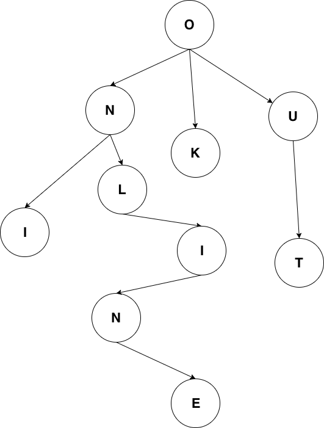

# 5.2 Routing

Ở những framework web thông thường, router sẽ có nhiều thành phần. Router trong ngôn ngữ Go cũng thường gọi bộ `multiplexer` của gói `http`. Trong phần trước, chúng ta đã học được làm cách nào dùng `http mux` là một thư viện chuẩn để hiện thực hàm routing đơn giản. Nếu việc phát triển hệ thống Web không quan tâm đến thiết kế các URI chứa parameters thì chúng ta có thể dùng thư viện chuẩn `http`  `mux`.

RESTful là một làn sóng thiết kế API bắt đầu những năm gần đây. Ngoài những phương thức GET, POST , RESTful cũng quy định vài tiêu chuẩn khác được định nghĩa bởi giao thức HTTP bao gồm

Nhìn vào những đường dẫn RESTful sau

```
GET /repos/:owner/:repo/comments/:id/reactions

POST /projects/:project_id/columns

PUT /user/starred/:owner/:repo

DELETE /user/starred/:owner/:repo
```

Nếu bạn thông minh, có thể đoán được ngay ý nghĩa của chúng. Đó là một vài API được chọn ra từ tài liệu của trang chủ Github. Kiểu RESTful API phụ thuộc rất nhiều vào request path. Nhiều tham số được thay thế trong request URI. Thêm vào đó, rất ít những HTTP status chung được dùng, nhưng phần này chỉ tập trung bàn về routing, do đó lượt bỏ những điều khác.

Nếu hệ thống của chúng ta cần có những API tương tự vậy, việc sử dụng thư viện chuẩn `mux` hiển nhiên là không đủ.

## 5.2.1 httpRouter

Nhiều opensource Web phổ biến của Go thường sử dụng `httpRouter`, hoặc hỗ trợ cho routing dựa trên những biến thể của httpRouter. Những API chứa parameters như của Github ở trên có thể được hỗ trợ bởi httpRouter.

Bởi vì khi sử dụng httpRouter, bạn cần phải tránh một số ngữ cảnh mà nó dẫn đến xung đột routing khi thiết kế các routes, ví dụ

```
conflict:
GET /user/info/:name
GET /user/:id

no conflict:
GET /user/info/:name
POST /user/:id
```

Tóm lại, nếu hai routes có sự đồng nhất về http method (GET/POST/PUT/DELETE) và đồng nhất tiền tố request path, và một A route xuất hiện ở một nơi nào đó, nó sẽ là một kí tự đại diện (trường hợp trên là :id), B route là một string bình thường, thì một route sẽ xung đột, xung đột routing sẽ trực tiếp sẽ phát sinh ra lỗi có thể bắt được thông qua panic

```
panic: wildcard route ':id' conflicts with existing children in path '/user/:id'

goroutine 1 [running]:
github.com/cch123/httprouter.(*node).insertChild(0xc4200801e0, 0xc42004fc01, 0x126b177, 0x3, 0x126b171, 0x9, 0x127b668)
  /Users/caochunhui/go_work/src/github.com/cch123/httprouter/tree.go:256 +0x841
github.com/cch123/httprouter.(*node).addRoute(0xc4200801e0, 0x126b171, 0x9, 0x127b668)
  /Users/caochunhui/go_work/src/github.com/cch123/httprouter/tree.go:221 +0x22a
github.com/cch123/httprouter.(*Router).Handle(0xc42004ff38, 0x126a39b, 0x3, 0x126b171, 0x9, 0x127b668)
  /Users/caochunhui/go_work/src/github.com/cch123/httprouter/router.go:262 +0xc3
github.com/cch123/httprouter.(*Router).GET(0xc42004ff38, 0x126b171, 0x9, 0x127b668)
  /Users/caochunhui/go_work/src/github.com/cch123/httprouter/router.go:193 +0x5e
main.main()
  /Users/caochunhui/test/go_web/httprouter_learn2.go:18 +0xaf
exit status 2
```

Một điểm đáng chú ý khác là dù httprouter đã xử lý được độ sâu của cây từ điển, số lượng parameters  được giới hạn trong quá trình khởi tạo, do đó số lượng parameters trong route không thể vượt quá 255. Còn không, httprouter sẽ không nhận diện được những subsequent parameters. Tuy nhiên, sẽ không cần nghĩ nhiều về điểm này. Sau tất cả, URI được thiết kế bởi con người. Tôi tin rằng sẽ không có một URL dài nào có quá 200 parameter trong đường dẫn.

httpRouter hỗ trợ kí tự đặc biệt `*` trong đường dẫn, ví dụ

```
Pattern: /src/*filepath

/src/                     filepath = ""
/src/somefile.go          filepath = "somefile.go"
/src/subdir/somefile.go   filepath = "subdir/somefile.go"
```

Thiết kế này có thể ít phổ biến trong RESTful, chủ yếu cho phép một HTTP static file server đơn giản sử dụng httprouter.

Ngoài việc hỗ trợ routing thông thường, httprouter cũng hỗ trợ customization của hàm callback trong một vài trường hợp đặc biệt như là lỗi 404

```
r := httprouter.New()
r.NotFound = http.HandlerFunc(func(w http.ResponseWriter, r *http.Request) {
    w.Write([]byte("oh no, not found"))
})
```

Hoặc, khi panic bên trong 

```go
r.PanicHandler = func(w http.ResponseWriter, r *http.Request, c interface{}) {
    log.Printf("Recovering from panic, Reason: %#v", c.(error))
    w.WriteHeader(http.StatusInternalServerError)
    w.Write([]byte(c.(error).Error()))
}
```

Hiện tại cộng đồng opensource có một web framework được rất nhiều star là [gin](https://github.com/gin-gonic/gin) sử dụng httprouter.

## 5.2.2 Principle

Cấu trúc dữ liệu được dùng bởi httprouter và nhiều routers dẫn xuất khác là Radix Tree. Người đọc có thể sẽ liên tưởng đến những cây khác như `compressed dictionary tree` và hoặc đã nghe về dictionary tree (Trie Tree). Hình 5.1 là một kiểu cấu trúc dictionary tree.



Dictionary tree thường được dùng để duyệt string, như là xây dựng một cây từ điển với một chuỗi kí tự. Với mỗi target string, cũng như việc tìm kiếm theo chiều sâu được bắt đầu từ node gốc, có thể đánh giá được khi nào string xuất hiện với độ phức tạp O(n), và n là chiều dài của string. Tại sao chúng ta lại làm như vậy? Bản thân string không phải là kiểu số học nên không thêm so sánh như số được, và thời giam xấp xỉ của hai chuỗi khi so sánh với nhau phụ thuộc vào chiều dài của chuỗi.Nếu bạn muốn dùng cây từ điển ở hàm trên, bạn cần phải sắp xếp lịch sử các chuỗi, và sau đó dùng thuật toán như là binary search, thời gian xấp xỉ chỉ cao. Cây từ điển có thể được xem xét như là một các thông thường để thay đổi khoảng cách thay đổi về thời gian.

Nhưng cây từ điển thông thường có một điểm bất lợi, đó là, mỗi kí tự cần phải được thiết lập là một node con