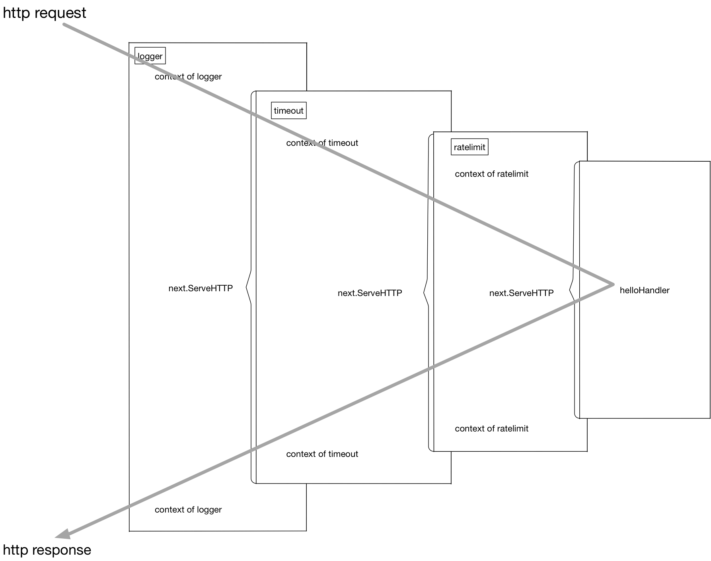
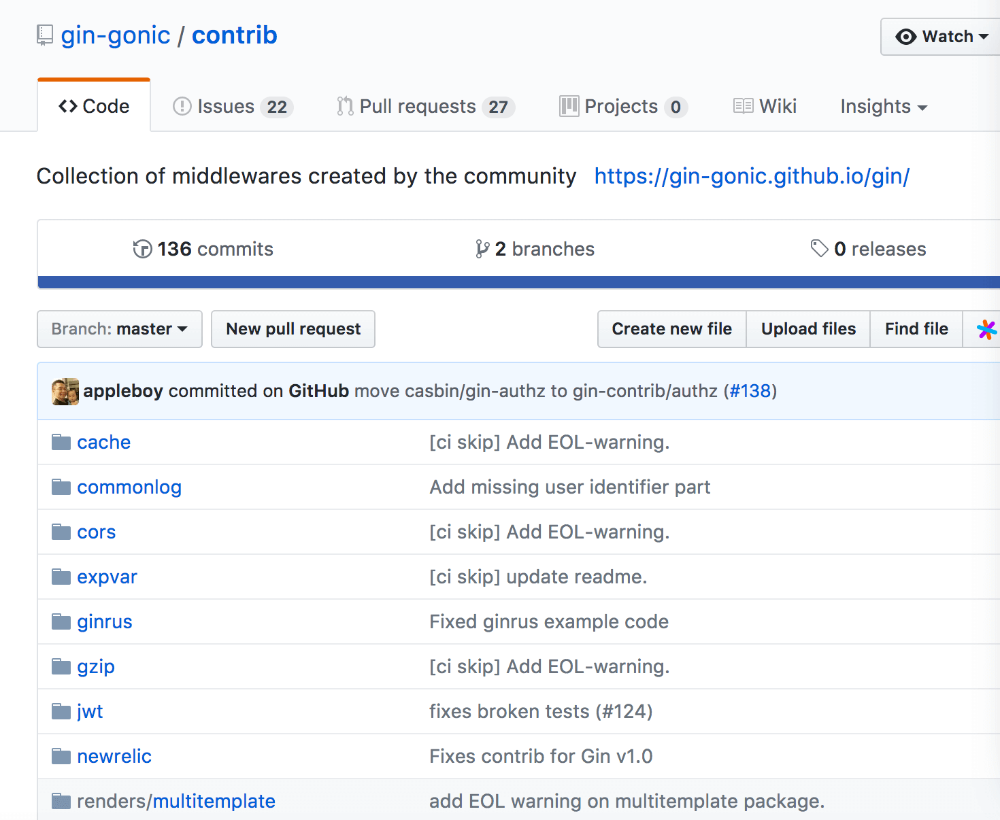

# 5.3 Middleware

Chương này sẽ phân tích những nguyên tắc về kỹ thuật middleware ngày nay với một framework web phổ biến và chỉ ra làm thế nào để dùng kỹ thuật middleware này để tách biệt mã nguồn business và non-business.

## 5.3.1 Code mire

Hãy nhìn vào đoạn mã nguồn sau

```go
package main

func hello(wr http.ResponseWriter, r *http.Request) {
    wr.Write([]byte("hello"))
}

func main() {
    http.HandleFunc("/", hello)
    err := http.ListenAndServe(":8080", nil)
    ...
}
```

[>> mã nguồn](../examples/ch5/ch5.3/example1/main.go)

Đây là một kiểu webservice sẽ mount tới một route đơn giản. Những service online của chúng tôi thường được phát triển và mở rộng từ những service đơn giản.

Bây giờ có một số nhu cầu mới, chúng tôi muốn tính được thời gian xử lý của hello service được viết trước đây, nhu cầu này rất đơn giản, chúng tôi sẽ làm một số thay đổi nhỏ trên chương trình ở trên.

```go
var logger = log.New(os.Stdout, "", 0)

func hello(wr http.ResponseWriter, r *http.Request) {
    timeStart := time.Now()
    wr.Write([]byte("hello"))
    timeElapsed := time.Since(timeStart)
    logger.Println(timeElapsed)
}
```

[>> mã nguồn](../examples/ch5/ch5.3/example2/main.go)

Việc này cho phép để in ra thời gian mà một request hiện tại chạy, mỗi khi nhận được một http request.

Sau khi hoàn thành yêu cầu, chúng tôi sẽ tiếp tục phát triển service của chúng tôi, và API được cung cấp gia tăng một cách liên tục, Bây giờ các route sẽ trông như sau:

```go
package main

func helloHandler(wr http.ResponseWriter, r *http.Request) {
    // ...
}

func showInfoHandler(wr http.ResponseWriter, r *http.Request) {
    // ...
}

func showEmailHandler(wr http.ResponseWriter, r *http.Request) {
    // ...
}

func showFriendsHandler(wr http.ResponseWriter, r *http.Request) {
    timeStart := time.Now()
    wr.Write([]byte("your friends is tom and alex"))
    timeElapsed := time.Since(timeStart)
    logger.Println(timeElapsed)
}

func main() {
    http.HandleFunc("/", helloHandler)
    http.HandleFunc("/info/show", showInfoHandler)
    http.HandleFunc("/email/show", showEmailHandler)
    http.HandleFunc("/friends/show", showFriendsHandler)
    // ...
}
```

[>> mã nguồn](../examples/ch5/ch5.3/example3/main.go)

Mỗi handler có một đoạn mã nguồn để ghi lại thời gian được đề cập từ trước. Mỗi lần chúng tôi thêm vào một route mới, cần phải sao chép những mã nguồn tương tự tới nơi chúng ta ta cần, bởi vì số lượng route ít, nên không phải là vấn đề lớn khi hiện thực.

Dần dần hệ thống của chúng ta có khoảng 30 routes và `handler` functions. Mỗi lần chúng ta thêm một handler, công việc đầu tiên là sao chép lại những phần mã nguồn ngoại vi không liên quan đến business logic.

Sau khi hệ thống sẽ chạy an toàn trong một quãng thời gian, nhưng bỗng nhiên một ngày, sếp tìm bạn. Chúng tôi đã tìm thấy được người có thể phát triển hệ thống monitoring mới. Hệ thống mới sẽ được điều khiển linh hoạt hơn, chúng tôi cần bản báo cáo về dữ liệu thời gian dành cho mỗi interface. Trong hệ thống monitoring. Đặt cho hệ thống một cái tên là metrics. Bây giờ chúng ta cần phải thay đổi mã nguồn và gửi thời gian đến hệ thống metrics thông qua HTTP POST. Hãy thay đổi nó `helloHandler()`

```go
func helloHandler(wr http.ResponseWriter, r *http.Request) {
    timeStart := time.Now()
    wr.Write([]byte("hello"))
    timeElapsed := time.Since(timeStart)
    logger.Println(timeElapsed)
    // Thêm phần tính thời gian
    metrics.Upload("timeHandler", timeElapsed)
}
```

Khi thay đổi, chúng ta có thể dễ dàng thấy rằng công việc phát triển của chúng ta sẽ rơi vào bế tắc. Bất kể nhu cầu phi chức năng hoặc thống kê trên hệ thống Web của chúng ta trong tương lai, các sửa đổi sẽ ảnh hưởng tới toàn bộ. Cũng như khi ta thêm một nhu cầu thống kê đơn giản, chúng ta cần phải thêm hàng tá những mã nguồn độc lập với business. Mặc dùng chúng dường như sẽ không có lỗi trong thời gian đầu, có thể thấy rõ hơn khi business càng phát triển.

## 5.3.2 Sử dụng middleware để xử lý non-business logic

Hãy phân tích, khi chúng ta làm một số thứ sai tại thời điểm ban đầu? Chúng ta cần hiện thực yêu cầu theo từng bước, ghi xuống luồng logic chúng ta cần phải theo tiến trình.

Trong thực tế, lỗi lầm lớn nhất chúng ta gây ra là đặt mã nguồn business và non-business cùng nhau. Trong hầu hết trường hợp, những yêu cầu non-business là làm một thứ gì đó trước khi xử lý HTTP request, và làm một thứ gì đó ngay sau khi chúng hoàn thành. Có thể dùng một vài ý tưởng tái cấu trúc lại mã nguồn để tách riêng mã nguồn của non-business riêng. Trở lại ví dụ ban đầu, chúng ta cần một hàm `helloHandler()` để tăng thời gian thống kê về timeout, chúng ta có thể dùng một `function adapter` gọi là `helloHandler()` để wrap:

```go
func hello(wr http.ResponseWriter, r *http.Request) {
    wr.Write([]byte("hello"))
}

func timeMiddleware(next http.Handler) http.Handler {
    return http.HandlerFunc(func(wr http.ResponseWriter, r *http.Request) {
        timeStart := time.Now()

        // next handler
        next.ServeHTTP(wr, r)

        timeElapsed := time.Since(timeStart)
        logger.Println(timeElapsed)
    })
}

func main() {
    http.Handle("/", timeMiddleware(http.HandlerFunc(hello)))
    err := http.ListenAndServe(":8080", nil)
    ...
}
```

[>> mã nguồn](../examples/ch5/ch5.3/example4/main.go)

Rất dễ đạt được sự tách biệt giữa business và non-business, mấu chốt nằm ở hàm `timeMiddleware`. Có thể thấy từ mã nguồn rằng, hàm `timeMiddleware()` cũng là một hàm chứa parameters `http.Handler` và `http.Handler` được định nghĩa trong gói `net/http`.

```go
type Handler interface {
    ServeHTTP(ResponseWriter, *Request)
}
```

Bất cứ hàm nào định nghĩa `ServeHTTP`, nó sẽ hợp lệ trong `http.Handler`, bạn đọc nó và sẽ có một số mơ hồ, hãy chọn ra những HTTP library `Handler`, `HandlerFunc` và `ServeHTTP` để thấy mối quan hệ giữa chúng.

```go
type Handler interface {
    ServeHTTP(ResponseWriter, *Request)
}

type HandlerFunc func(ResponseWriter, *Request)

func (f HandlerFunc) ServeHTTP(w ResponseWriter, r *Request) {
    f(w, r)
}
```

Trong thực tế, handler signature của chúng ta là:

```go
func (ResponseWriter, *Request)
```

Do đó `handler` và `http.HandlerFunc()` sẽ có một sự đồng nhất về function signature (chữ ký hàm), bạn có thể dùng kiểu `handler()` trong hàm, và chuyển đổi nó với `http.HandlerFunc`. Khi thư viện `http` cần gọi hàm `HandlerFunc()` của bạn để xử lý request, hàm `ServeHTTP()` sẽ được gọi để chỉ ra những chuỗi gọi cơ bản của request như sau:

```go
h = getHandler() => h.ServeHTTP(w, r) => h(w, r)
```

Hàm `handler` được chuyển đổi thành `http.HandlerFunc()`, quá trình này là cần thiết bởi vì chúng ta có `handler` không hiện thực interface `ServeHTTP` một cách trực tiếp. Hàm `CastleFunc` (chú ý rằng không có sự khác nhau giữa `HandlerFunc` và `HandleFunc`) chúng ta nhìn thấy mã nguồn dưới để thấy quá trình cast.

```go
func HandleFunc(pattern string, handler func(ResponseWriter, *Request)) {
    DefaultServeMux.HandleFunc(pattern, handler)
}


func (mux *ServeMux) HandleFunc(pattern string, handler func(ResponseWriter, *Request)) {
    mux.Handle(pattern, HandlerFunc(handler))
}
```

Middleware sẽ được hiểu là một hàm truyền vào handler và trả về một handler mới.

Để tóm tắt, những gì mà middleware được bao bọc hàm handler thông qua một hoặc nhiều hàm, trả về một chuỗi các hàm, nó bao gồm logic của mỗi middleware. Chúng ta có thể làm packaging trên trở nên phức tạp hơn.

```go
customizedHandler = logger(timeout(ratelimit(helloHandler)))
```

Ngữ cảnh của chuỗi các hàm trong quá trình thực thi có thể được thể hiện bởi hình 5.8



Một cách đơn giản, quá trình này thực hiện đẩy vào một function và sau đó lấy nó ra khi một request được hiện thực. Có một số luồng thực thi tương tự như gọi đệ quy.

```go
[exec of logger logic]           Stack: []

[exec of timeout logic]          Stack: [logger]

[exec of ratelimit logic]        Stack: [timeout/logger]

[exec of helloHandler logic]     Stack: [ratelimit/timeout/logger]

[exec of ratelimit logic part2]  Stack: [timeout/logger]

[exec of timeout logic part2]    Stack: [logger]

[exec of logger logic part2]     Stack: []
```

Khi hàm được hiện thực, nhưng chúng ta có thể thấy rằng ở trên, việc dùng hàm này không thực sự đệp, và nó không có bất cứ tính dễ đọc nào.

## 5.3.3 More elegant middleware writing

Trong chương trước, sự tách biệt về mã nguồn hàm business và non-business function được giải quyết, nhưng cũng không tốt hơn lắm, Nếu bạn cần phải thay đổi thứ tự của những hàm đó, hoặc thêm, hoặc xóa middleware vẫn còn một số khó khăn, phần này chúng ta sẽ thực hiện việc tối ưu bằng cách viết .


Nhìn vào ví dụ

```go
r = NewRouter()
r.Use(logger)
r.Use(timeout)
r.Use(ratelimit)
r.Add("/", helloHandler)
```

Qua nhiều bước thiết lập, chúng ta có một chuỗi thực thi các hàm tương tự như trước. Điểm khác biệt là trực quan hơn và dễ hơn để hiểu. Nêu bạn muốn thêm hoặc xóa middleware, đơn giản thêm và xóa dòng ứng với lời gọi `Use()`. Rất thuận tiện.

Từ ngữ cảnh của framework, làm sao chúng ta đạt được hàm đó? Không phức tạp lắm


```go
type middleware func(http.Handler) http.Handler

type Router struct {
    middlewareChain [] middleware
    mux map[string] http.Handler
}

func NewRouter() *Router{
    return &Router{}
}

func (r *Router) Use(m middleware) {
    r.middlewareChain = append(r.middlewareChain, m)
}

func (r *Router) Add(route string, h http.Handler) {
    var mergedHandler = h

    for i := len(r.middlewareChain) - 1; i >= 0; i-- {
        mergedHandler = r.middlewareChain[i](mergedHandler)
    }

    r.mux[route] = mergedHandler
}
```

[>> mã nguồn](../examples/ch5/ch5.3/example5/main.go)

Chú ý rằng, duyệt `middleware` array theo thứ tự của mã nguồn ngược lại với thứ tự chúng ta muốn gọi, không khó để hiểu chúng.

## 5.3.4 Làm thế nào để làm việc với middleware thích hợp

Hãy xem xét một opensource phổ biến trong framework Go như ví dụ sau

```
compress.go
  => compress the response
heartbeat.go
  => ping, health check
logger.go
  => log lại việc sử lý yêu cầu
profiler.go
  => định tuyến các yêu cầu được xử lý bởi pprof, chẳng hạn như pprof để track cho hệ thống
realip.go
  => đọc X-Forwarded-For và X-Real-IP từ tiêu đề yêu cầu và sửa đổi RemoteAddr trong http.Request để nhận RealIP.
requestid.go
  => tạo một requestid riêng cho yêu cầu này, có thể được sử dụng để tạo liên kết cuộc gọi phân tán và cũng có thể được sử dụng để kết nối tất cả các yêu cầu được sử lý
timeout.go
  => đặt thời gian chờ với context.Timeout và chuyển qua http.Request
throttler.go
  => lưu trữ mã thông báo qua các kênh có độ dài cố định và giới hạn giao diện thông qua các mã thông báo này.
```

Mỗi web framework sẽ có những thành phần middleware tương ứng. Nếu bạn quan tâm, bạn có thể  đóng góp những middleware hữu ích cho dự án, đó là lý do để thông thường để người maintainers sẵn sàng để merge pull request của bạn.

Ví dụ, cộng động opensource đóng góp cho fire `gin` framework, nó được thiết kế cho users để đóng góp vào kho middleware.



Nếu người đọc đọc mã nguồn của gin, có thể thấy được rằng gin middleware không dùng `http.Handler`, nhưng `gin.HandlerFunc` thì được gọi, và `http.Handler`sẽ khác với những mẫu signature trong phần này.

